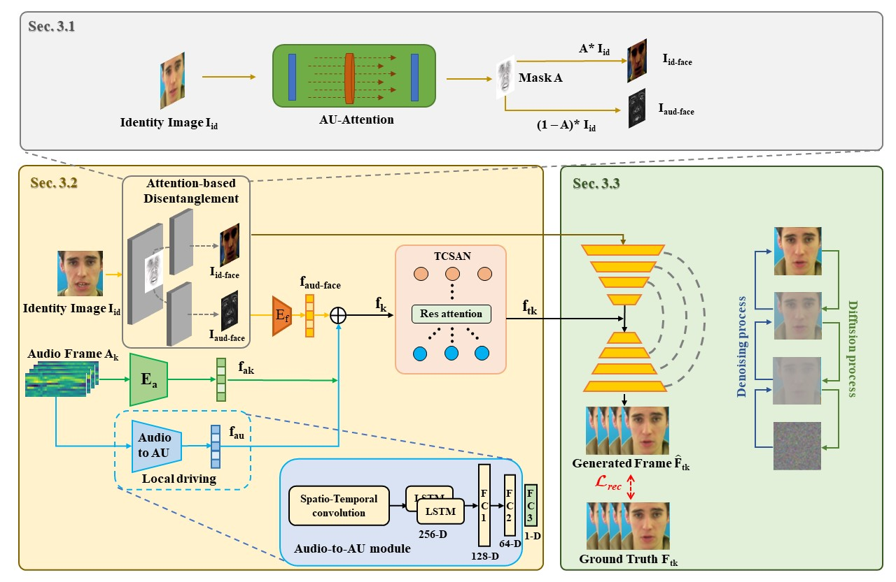

# Multimodal Fusion for Talking Face Generation Utilizing Speech-related Facial Action Units

Official PyTorch implementation for the paper:

> **Multimodal Fusion for Talking Face Generation Utilizing Speech-related Facial Action Units**.
>
> Zhilei Liu, Xiaoxing Liu, Sen Chen, Jiaxing Liu, Longbiao Wang, Chongke Bi

<p align="center">

</p>

## News
Thank you to all the reviewers for their feedback.

- We update to improve the performance of this project.


## Environment

- python 3.7.0
- pytorch 1.10.0
- pytorch-lightning 1.2.5
- torchvision 0.11.0
- pytorch-lightning==1.2.5

Create conda environment:
```bash
conda create -n xxx python=3.7.0
conda activate xxx
pip install torch==1.12.1+cu113 torchvision==0.13.1+cu113 torchaudio==0.12.1 --extra-index-url https://download.pytorch.org/whl/cu113
pip install -r requirements.txt
```

## **Dataset**

1. Download the dataset: [GRID](https://pubs.aip.org/asa/jasa/article-abstract/120/5/2421/934379/An-audio-visual-corpus-for-speech-perception-and)
和[TCD-TIMIT](https://ieeexplore.ieee.org/abstract/document/7050271)

2. We provide preprocessing code for datasets. You can use /pre_data_code/ to preprocess datasets.

3. Additionally, you need to download [Openface](https://ieeexplore.ieee.org/document/8373812)
to extract AUs from images.
The final format of the dataset is illustrated in the following figure:

./data_list/GRID_new_data_test:

    |——data/GRID_new_data_test/28/0
       |——align_face
          |——0.jpg
          |——0.csv
          |——0.lms
          |——1.jpg
          |——1.csv
          |——1.lms
          |——...
       |——mfcc32
          |——mfcc.npy
       |——identity_image
       |——0.wav

./data/grid_test.txt:

    /data/GRID_new_data_test/28/0/align_face /data/GRID_new_data_test/28/0/mfcc32
    /data/GRID_new_data_test/28/1/align_face /data/GRID_new_data_test/28/1/mfcc32
    /data/GRID_new_data_test/28/2/align_face /data/GRID_new_data_test/28/2/mfcc32
    ...
    /data/GRID_new_data_test/N/M/align_face /data/GRID_new_data_test/N/M/mfcc32

## **Demo**

1. Parameter download [link](https://pan.baidu.com/s/1FfBxgqX-yxUTIP2AvT32Eg?pwd=jc3j)
. These parameters appear in the code inference.py, and you can download them into any folder you desire.

2. Run：
```bash
yhbatch inference.sh
```

## **Advice**
The project is best run in an environment with more than two GPUs. You can adjust the number of GPUs in inference.sh.

## **Contact**
If you have any questions, please contact xiaoxingliu@tju.edu.cn.
